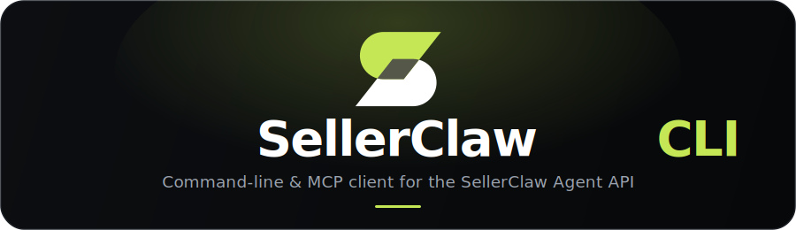

<div align="center">



<br/>
<br/>

[](https://pypi.org/project/sellerclaw-cli/)
[](https://pypi.org/project/sellerclaw-cli/)
[](https://github.com/sellerai-com/sellerclaw-cli/actions/workflows/ci.yml)
[](#mcp-server-for-claude-and-other-mcp-agents)
[](LICENSE)

**Run your stores, orders, listings, ads & suppliers from a terminal, scripts, or Claude — structured JSON in, structured JSON out.**

[Install](#installation) · [Quick start](#quick-start) · [Use from Claude (MCP)](#mcp-server-for-claude-and-other-mcp-agents) · [Output contract](#output-contract) · [Troubleshooting](#troubleshooting)

</div>

---

`sellerclaw-cli` is the command-line client for the [SellerClaw](https://sellerclaw.ai) Agent API. It is designed to be driven either directly from a terminal or, more commonly, as a subprocess by automation and LLM agents. Every command:

- returns structured **JSON on stdout** on success,
- returns structured **JSON on stderr** on failure,
- exits with a **stable, categorical exit code**,
- reads credentials only from env / config file — **never** from argv.

The CLI ships a hand-curated set of typed command groups over the SellerClaw Agent API, with built-in discovery (`groups` / `commands` / `describe` / `guide`) so an agent can explore the surface without external docs. When no curated command fits a Shopify task, a raw Admin GraphQL query/mutation is reachable via `sellerclaw shopify graphql`.

**Use it from Claude.** The same CLI doubles as an **MCP server**, so Claude Desktop, Claude Code, Cursor or any [Model Context Protocol](https://modelcontextprotocol.io) client can drive SellerClaw natively — sign in once in your browser, no API key to copy. See [MCP server](#mcp-server-for-claude-and-other-mcp-agents) for the Claude plugin, the one-line installer, the Claude Desktop extension, and the skill.

---

## Table of contents

- [Requirements](#requirements)
- [Installation](#installation)
- [Quick start](#quick-start)
- [Configuration](#configuration)
  - [Environment variables](#environment-variables)
  - [Config file](#config-file)
  - [Priority / resolution order](#priority--resolution-order)
  - [Inspecting the current config](#inspecting-the-current-config)
- [Authentication](#authentication)
  - [Device flow (recommended)](#device-flow-recommended)
  - [Email + password](#email--password)
  - [Manual token](#manual-token)
  - [Logging out](#logging-out)
- [Using the CLI](#using-the-cli)
  - [Command structure](#command-structure)
  - [Command groups](#command-groups)
  - [Discovery](#discovery)
  - [Passing request bodies](#passing-request-bodies)
  - [Output formats](#output-formats)
- [Output contract](#output-contract)
  - [Success shape](#success-shape)
  - [Error shape](#error-shape)
  - [Exit codes](#exit-codes)
  - [Retry behavior](#retry-behavior)
- [Using from scripts and LLM agents](#using-from-scripts-and-llm-agents)
- [MCP server (for Claude and other MCP agents)](#mcp-server-for-claude-and-other-mcp-agents)
- [Agent identification](#agent-identification)
- [Environment variables reference](#environment-variables-reference)
- [Troubleshooting](#troubleshooting)
- [Uninstall](#uninstall)
- [Development](#development)

---

## Requirements

- Python **3.11+** (3.11, 3.12, 3.13 are all tested in CI).
- Linux, macOS, or Windows (POSIX file-permission handling applies only on Linux/macOS).
- Network access to your SellerClaw Agent API endpoint.

## Installation

Install from PyPI:

```sh
pip install sellerclaw-cli
```

or with [`uv`](https://docs.astral.sh/uv/):

```sh
uv pip install sellerclaw-cli
# or, to install as a tool you can run anywhere:
uv tool install sellerclaw-cli
```

Verify the install:

```sh
sellerclaw --version
# 0.1.0
```

The installed binary is `sellerclaw` (not `sellerclaw-cli`).

To also run the MCP server for Claude, install with the `mcp` extra — `pip install 'sellerclaw-cli[mcp]'` (or `uv tool install 'sellerclaw-cli[mcp]'`). See [MCP server](#mcp-server-for-claude-and-other-mcp-agents).

## Quick start

```sh
# 1. Install
pip install sellerclaw-cli

# 2. Authenticate (opens a URL + code you confirm in a browser)
sellerclaw auth login

# 3. Call an endpoint
sellerclaw shopify-listings list <STORE_ID> --status active --limit 5
```

That's it. See below for details on configuration, other auth flows, and output conventions.

---

## Configuration

The CLI needs two pieces of configuration:

- **`api_url`** — base URL of the Agent API (default: `https://api.sellerclaw.ai`).
- **`token`** — your personal `sca_…` agent token used for `Authorization: Bearer …` on every request.

Both can be supplied either via environment variables or via a config file.

### Environment variables

| Variable | Purpose | Default |
| --- | --- | --- |
| `SELLERCLAW_TOKEN` | Agent token (`sca_…`). Always sent as `Authorization: Bearer <token>`. | *(none)* |
| `SELLERCLAW_API_URL` | Base URL of the Agent API. | `https://api.sellerclaw.ai` |
| `XDG_CONFIG_HOME` | Base dir for the config file (standard XDG behavior). | `~/.config` |

Example:

```sh
export SELLERCLAW_TOKEN="sca_abc123..."
export SELLERCLAW_API_URL="https://api.example.com"
sellerclaw auth whoami
```

### Config file

The config file is a small TOML file stored at:

- `$XDG_CONFIG_HOME/sellerclaw/config.toml` if `XDG_CONFIG_HOME` is set, otherwise
- `~/.config/sellerclaw/config.toml`.

Format:

```toml
api_url = "https://api.example.com"
token = "sca_abc123..."
```

Either key is optional. The file is created automatically by `sellerclaw auth login` / `sellerclaw auth logout`, with mode `0600` (owner read/write only) on POSIX systems.

You can also create or edit the file by hand:

```sh
mkdir -p ~/.config/sellerclaw
cat > ~/.config/sellerclaw/config.toml <<'EOF'
api_url = "https://api.example.com"
token   = "sca_abc123..."
EOF
chmod 600 ~/.config/sellerclaw/config.toml
```

### Priority / resolution order

For each of `api_url` and `token`, the CLI picks the **first** non-empty source, resolved independently:

1. Environment variable (`SELLERCLAW_API_URL`, `SELLERCLAW_TOKEN`).
2. Key in `config.toml` (`api_url`, `token`).
3. Built-in default (`api_url = https://api.sellerclaw.ai`; no default token).

This means you can, for example, keep `api_url` in the config file and inject the token only via env — handy for CI and container workflows:

```sh
# ~/.config/sellerclaw/config.toml has only api_url
SELLERCLAW_TOKEN="$CI_TOKEN" sellerclaw shopify-listings list "$STORE_ID"
```

### Inspecting the current config

```sh
sellerclaw auth whoami
# {"data":{"authenticated":true,"api_url":"https://api.example.com","config_path":"/home/you/.config/sellerclaw/config.toml"}}
```

`authenticated: true` means a token is configured (it is not validated against the server — make any real call to verify).

---

## Authentication

### Device flow (recommended)

Best for interactive use on your own machine:

```sh
sellerclaw auth login
```

The CLI prints a URL and a short code **to stderr** (so it never pollutes a stdout pipeline):

```
Open https://sellerclaw.ai/activate
Enter the code: ABCD-1234
(waiting up to 600s, polling every 5s...)
```

Open the URL in a browser, paste the code, confirm. The CLI polls the API until the token is granted, then writes it to the config file. On success, stdout gets:

```json
{"data":{"authenticated":true,"api_url":"https://api.sellerclaw.ai","config_path":"/home/you/.config/sellerclaw/config.toml"}}
```

### Email + password

```sh
sellerclaw auth login --password
# Email: you@example.com
# Password: ********
```

When stdin is not a TTY (e.g. piped), supply two lines — email, then password:

```sh
printf '%s\n%s\n' "you@example.com" "$PASSWORD" \
  | sellerclaw auth login --password
```

Password is never echoed and never appears in argv or environment.

### Manual token

If you already have an `sca_…` token (for example, provisioned by a backoffice tool), just put it into the config file or export the env var:

```sh
export SELLERCLAW_TOKEN="sca_abc123..."
# OR
echo 'token = "sca_abc123..."' >> ~/.config/sellerclaw/config.toml
```

### Logging out

```sh
sellerclaw auth logout
```

Removes the `token` key from the config file. The `api_url` setting (and anything else in the file) is preserved.

---

## Using the CLI

### Command structure

```
sellerclaw [GLOBAL OPTIONS] <group> <command> [COMMAND ARGS]
```

Discover what's available:

```sh
sellerclaw --help                        # list top-level groups
sellerclaw <group> --help                # list commands in a group
sellerclaw <group> <command> --help      # show args + options for one command
```

### Command groups

The CLI is organized into hand-curated top-level groups (`channels`, `shopify-listings`, `ebay-listings`, `research-seo`, `orders`, …), each with a small set of consistent verbs (`list`, `get`, `create`, `update`, `delete`, plus domain verbs like `publish`, `sync`, `search`). Path / parent ids are positional in path order; filters are flags:

```sh
# GET /agent/stores/{store_id}/listings?status=...&limit=...
sellerclaw shopify-listings list <STORE_ID> --status active --limit 10

# GET /agent/ebay/stores/{store_id}/listings/{listing_id}
sellerclaw ebay-listings get <STORE_ID> <LISTING_ID>

# POST /agent/research/seo/keyword-ideas
sellerclaw research-seo keyword-ideas --seed widgets
```

Use `--help` on any group or command to see its exact arguments.

### Discovery

The discovery commands are driven by the live command registry (no external docs needed):

```sh
# One-shot onboarding: conventions, group list, how to call commands
sellerclaw guide

# Every group with a one-line summary and command count
sellerclaw groups

# Commands in a group (omit --group for all)
sellerclaw commands --group shopify-listings

# Full detail for one command: positionals, flags, body, example
sellerclaw describe shopify-listings create
```

When no curated command fits a Shopify task, run a raw Admin GraphQL operation with
`sellerclaw shopify graphql <STORE_ID> -b '{"query": "...", "variables": {...}}'`.

### Passing request bodies

Any command that takes a request body accepts `--body` (short: `-b`; `--json-body` is kept as a deprecated alias). It supports three sources:

```sh
# 1. Literal JSON on the command line
sellerclaw shopify-listings publish <STORE_ID> \
  --body '{"ids": ["l1", "l2"]}'

# 2. File
sellerclaw shopify-listings create <STORE_ID> \
  --body @./product.json

# 3. Stdin (use @- as the value)
cat product.json | sellerclaw shopify-listings create <STORE_ID> \
  --body @-
```

The body is validated as JSON locally before any network call; invalid JSON exits with a `user_error` (exit 1).

### Output formats

`--format` is a **global** option (before the subcommand), defaulting to `json`:

| Value | Description |
| --- | --- |
| `json` (default) | Compact, single-line JSON. Ideal for pipelines (`jq`, LLM tools, scripts). |
| `pretty` | Indented JSON (2 spaces). Still valid JSON. |
| `yaml` | YAML. |
| `table` | ASCII table when the payload is a list of flat dicts; falls back to pretty JSON otherwise. |

```sh
sellerclaw --format pretty stores list-listings <STORE_ID>
sellerclaw --format yaml   stores list-listings <STORE_ID>
sellerclaw --format table  stores list-listings <STORE_ID>
```

**Errors are always compact JSON on stderr**, regardless of `--format`. Downstream error parsers can rely on a single stable shape.

---

## Output contract

### Success shape

On exit code `0`, stdout contains exactly one JSON value (plus a trailing newline):

```json
{"data": <payload>}
```

`<payload>` is whatever the API returned for that endpoint — a single object, a list, a primitive, or `null`.

### Error shape

On any non-zero exit, stderr contains exactly one JSON value:

```json
{
  "error": {
    "code":    "auth_error",
    "message": "Unauthorized",
    "status":  401,
    "details": { /* optional, parsed from the API response body */ },
    "hint":    "Run `sellerclaw auth login` to authenticate."
  }
}
```

Field presence:

- `code` and `message` — always present.
- `status` — present when the error originated from an HTTP response.
- `details` — present when the API returned a structured error body.
- `hint` — present for `auth_error` (currently always points at `sellerclaw auth login`).

### Exit codes

| Code | Meaning | Typical triggers |
| --- | --- | --- |
| `0` | Success | any 2xx |
| `1` | User error | invalid CLI args, invalid JSON body, 4xx (non-auth), unknown group/command |
| `2` | Server / network error | 5xx after retries, connection refused, timeout |
| `3` | Auth error | 401, 403, missing token |

These are stable and categorical — scripts can switch on them without parsing stderr.

### Retry behavior

The CLI transparently retries up to **3 attempts** on these conditions:

- HTTP status `429`, `502`, `503`, `504`
- Transient transport errors: `ConnectError`, `ReadError`, `WriteError`, timeouts

Backoff between retries is exponential with a small jitter, capped at 10 seconds. When the server sends a `Retry-After` header (seconds), the CLI honors it exactly (no extra jitter on top). All other statuses and unknown httpx errors are returned immediately — no retries.

Requests time out after **30 seconds** by default.

---

## Using from scripts and LLM agents

The CLI was designed specifically to be wrapped as a subprocess. Conventions that make that robust:

- **Pure JSON on stdout.** No progress bars, no log lines, no `rich` decoration leaking from stdout. Anything human-facing (login prompts, device-flow URL) is on stderr only.
- **Pure JSON on stderr** on failure, with a stable shape.
- **Categorical exit codes.** You can branch on `returncode` without touching stderr.
- **No credentials in argv.** Even if you see a new CLI flag in the future, credentials will never be one of them. Pass them via env.
- **No interactive prompts in non-TTY mode.** `auth login --password` reads from piped stdin; every other command just runs.

Minimal Python wrapper:

```python
import json, os, subprocess

def run(*args, token=None, timeout=60):
    env = {**os.environ}
    if token:
        env["SELLERCLAW_TOKEN"] = token
    r = subprocess.run(
        ["sellerclaw", *args],
        env=env,
        capture_output=True,
        text=True,
        timeout=timeout,
    )
    if r.returncode == 0:
        return json.loads(r.stdout)["data"]

    err = json.loads(r.stderr)["error"]
    if r.returncode == 3:
        raise AuthError(err["message"])            # refresh token, retry
    if r.returncode == 2:
        raise TransientError(err["message"])       # safe to retry with backoff
    raise UserError(err["message"], details=err.get("details"))

stores = run("stores", "list-listings", store_id, "--status", "active", token=my_token)
```

Minimal shell wrapper:

```sh
if out=$(sellerclaw shopify-listings list "$STORE_ID" --status active 2>err.json); then
    echo "$out" | jq '.data'
else
    code=$?
    jq '.error' err.json
    case $code in
        3) echo "auth failed — refresh token" ;;
        2) echo "transient — retry later" ;;
        *) echo "fatal" ;;
    esac
    exit $code
fi
```

---

## MCP server (for Claude and other MCP agents)

Beyond running as a subprocess, the CLI can expose itself over the [Model Context Protocol](https://modelcontextprotocol.io) so **any MCP client — Claude Desktop, Claude Code, the Agent SDK, Cursor, …** — can drive SellerClaw natively.

Rather than emit ~250 tools (one per command), the server mirrors the CLI's own discovery model with **three thin tools** the client composes at runtime:

- `sellerclaw_groups` — list command groups and their commands;
- `sellerclaw_describe(group, command)` — full schema: positionals, flags, body fields, plus a ready `call_example`;
- `sellerclaw_run(group, command, positionals, flags, body)` — invoke a command.

New CLI commands appear automatically — there is nothing per-command to maintain.

### Claude plugin (skills + hooks + MCP in one install)

For **Claude Code** and **claude.ai** the cleanest path is the SellerClaw **plugin** — one install
brings the MCP server, the task skills (discover → describe → run, plus listings / orders / ads /
research recipes), and a session-start primer hook together, from our marketplace:

```text
/plugin marketplace add sellerai-com/sellerclaw-cli
/plugin install sellerclaw@sellerclaw
```

On **claude.ai (web)** add it under Customize → Personal plugins → *Add marketplace* (or *Upload
plugin*). Sign in once with `sellerclaw auth login` so the three MCP tools can act on your account.

> All variants are built from one source tree (`plugin/`) with `make plugin`. Claude Code / Desktop
> run the MCP locally via `uvx`; the web/cowork variant ships the same skills + hooks today and points
> at a hosted SellerClaw connector that is rolling out separately.

### Easiest: one-line installer

Installs `uv` + the CLI, signs you in via the browser, and wires the MCP server into Claude Desktop
and Claude Code automatically. Safe to re-run.

```sh
# macOS / Linux
curl -fsSL https://raw.githubusercontent.com/sellerai-com/sellerclaw-cli/main/scripts/install.sh | sh
```

```powershell
# Windows (PowerShell)
irm https://raw.githubusercontent.com/sellerai-com/sellerclaw-cli/main/scripts/install.ps1 | iex
```

Then restart Claude Desktop. (Opt-outs: `SELLERCLAW_SKIP_LOGIN=1`, `SELLERCLAW_FORCE_DESKTOP=1`.)

### Manual setup (three steps, no token to copy)

The MCP SDK is an optional extra (the base CLI never depends on it). `uv tool install` puts a
`sellerclaw` command on your PATH without any virtualenv fuss:

```sh
# 1. Install
uv tool install 'sellerclaw-cli[mcp]'        # or: pipx install 'sellerclaw-cli[mcp]'

# 2. Sign in — opens a browser, no API token to find or paste
sellerclaw auth login

# 3. Tell your MCP client to launch it (see below)
```

Step 2 stores your credentials in `~/.config/sellerclaw/config.toml`, and the MCP server reads the
**same** config — so **the MCP client never needs a token or any secret**. (Check it any time with
`sellerclaw auth whoami`, which prints the exact config file in use.)

### Connect Claude

Both snippets launch the server with `uvx … sellerclaw-cli[mcp]@latest`, so it **always runs the
latest published version automatically** — there is nothing to upgrade.

**Claude Code** (terminal) — one command, no secrets:

```sh
claude mcp add sellerclaw -- uvx --from 'sellerclaw-cli[mcp]@latest' sellerclaw mcp
```

**Claude Desktop** — add this to `claude_desktop_config.json` (Settings → Developer → Edit Config),
then restart Claude:

```json
{
  "mcpServers": {
    "sellerclaw": {
      "command": "uvx",
      "args": ["--from", "sellerclaw-cli[mcp]@latest", "sellerclaw", "mcp"]
    }
  }
}
```

That's the whole config — no `env`, no token. (If Claude Desktop can't find the `uvx` command,
replace `"command": "uvx"` with its absolute path — `which uvx` / `where uvx` prints it — because the
desktop app doesn't always inherit your shell's PATH.)

For **headless / automation** use where there is no browser to sign in, skip `auth login` and pass
credentials by environment instead — add an `"env": { "SELLERCLAW_TOKEN": "sca_…" }` block, or export
`SELLERCLAW_TOKEN` / `SELLERCLAW_API_URL` before launching.

> The signed-in account grants the MCP client the same access the agent has. Server-gated actions
> (e.g. sending email or marketing campaigns) still require the owner's approval, but most read and
> management operations do not — only connect clients you trust, and sign in with a per-user account.

### Claude Desktop Extension (.mcpb)

For a click-to-install experience, download the latest bundle and drag it onto Claude Desktop →
Settings → Extensions:

**[⬇ Download sellerclaw.mcpb](https://github.com/sellerai-com/sellerclaw-cli/releases/latest/download/sellerclaw.mcpb)**

The bundle launches `sellerclaw-cli[mcp]@latest` via `uvx`, so it **auto-updates to the newest
release** on its own — the only prerequisite is [`uv`](https://docs.astral.sh/uv/) on PATH (the
one-line installer above installs it for you). Sign-in still uses `sellerclaw auth login` (or paste a
token into the extension's optional field). To build the bundle yourself: `make mcpb` (produces
`dist/sellerclaw.mcpb`); the source lives under
[`plugin/targets/claude-desktop/`](plugin/targets/claude-desktop/).

### Teach Claude to use it (skill)

A **skill** documents the setup and the full command surface so Claude drives SellerClaw correctly
(discover → describe → run). It is just markdown — install it independently, **no CLI required**:

```sh
# macOS / Linux
curl -fsSL https://raw.githubusercontent.com/sellerai-com/sellerclaw-cli/main/scripts/install-skill.sh | sh
```

```powershell
# Windows (PowerShell)
irm https://raw.githubusercontent.com/sellerai-com/sellerclaw-cli/main/scripts/install-skill.ps1 | iex
```

It downloads into `~/.claude/skills/sellerclaw` (override with `SKILLS_DIR=~/.cursor/skills`). Or
copy the folder yourself — the source is
[`plugin/shared/skills/sellerclaw/`](plugin/shared/skills/sellerclaw/). Restart Claude Code (or reload
skills) afterward.

#### …or with `npx skills` (any agent)

If you use [`npx skills`](https://github.com/vercel-labs/skills), install the **setup skill** straight
from this repo — it teaches your agent how to install and connect SellerClaw, and works across Claude
Code, Cursor, Codex and the other agents the tool supports:

```sh
npx skills add sellerai-com/sellerclaw-cli --skill sellerclaw-setup
```

The source lives in [`skills/sellerclaw-setup/`](skills/sellerclaw-setup/). Drop `--skill …` to pick
from everything the repo offers.

---

## Agent identification

When the CLI is invoked from inside an LLM agent's workspace directory, it automatically attaches an `X-Agent-Id` header to every request so the server can attribute the call to the right agent. No flag, no env var, no caller-side wiring — the identifier is derived purely from the current working directory.

The CLI looks for a `workspace-<id>` segment in `os.getcwd()` and uses the **last** match. The id must match `^[A-Za-z0-9_-]+$` and be 1–64 characters; otherwise it is dropped silently and the header is not sent.

Example:

```text
cwd /home/node/.openclaw/workspace-supervisor
  → X-Agent-Id: supervisor

cwd /home/node/.openclaw/workspace-product_scout/sub/dir
  → X-Agent-Id: product_scout

cwd /home/node                       (no workspace segment)
  → header omitted
```

The header is purely informational on the server side; requests without it work exactly the same. There is no override knob — by design, the id is whatever the cwd says it is.

---

## Environment variables reference

| Variable | Read by | Purpose |
| --- | --- | --- |
| `SELLERCLAW_TOKEN` | every command | Agent token, sent as `Authorization: Bearer <token>`. Highest priority. |
| `SELLERCLAW_API_URL` | every command | Base URL of the Agent API. Overrides config file and default. |
| `XDG_CONFIG_HOME` | `auth *`, `whoami` | Base dir for the config file. Defaults to `~/.config`. |

---

## Troubleshooting

**`{"error":{"code":"auth_error",…,"status":401,…}}` / exit 3**
No token found, or token is wrong / expired. Run `sellerclaw auth login`, or check `sellerclaw auth whoami` to see which sources are in play and what `api_url` the CLI is targeting.

**`{"error":{"code":"network_error",…}}` / exit 2**
Can't reach the API. Verify `SELLERCLAW_API_URL` / config `api_url`, DNS, firewall. The CLI already retries transient failures 3× with backoff — a persistent `network_error` usually indicates a misconfigured URL or blocked egress.

**`{"error":{"code":"server_error",…,"status":5xx}}` / exit 2**
API itself returned 5xx after the CLI retried. If it persists, the platform is having an incident; otherwise retry later.

**`{"error":{"code":"user_error","message":"unknown group: …"}}` / `unknown command …`**
The group or command name doesn't exist in your installed version. Run `sellerclaw groups`, then `sellerclaw commands --group <group>` to see what's available; upgrade the package if the endpoint is newer.

**`{"error":{"code":"user_error",…}}` on a missing positional argument**
A required path / parent id wasn't supplied. Run `sellerclaw describe <group> <command>` to see the positionals (in path order) and an example invocation.

**`sellerclaw: command not found` after `pip install`**
The install directory isn't on `PATH`. On many systems `pip install --user` installs into `~/.local/bin`; add that to `PATH` or use `pipx install sellerclaw-cli` / `uv tool install sellerclaw-cli` which handle it for you.

**My config file keeps getting ignored**
Check `sellerclaw auth whoami` — the `config_path` it prints is the one it reads. Common causes: `XDG_CONFIG_HOME` pointing somewhere unexpected, or a typo in the TOML (it must be `api_url` and `token`, lowercase, at the top level).

---

## Uninstall

```sh
pip uninstall sellerclaw-cli
# optional — remove config + token
rm -rf ~/.config/sellerclaw
```

---

## Development

Command groups are **hand-curated** — see [`sellerclaw_cli/_command_group.py`](sellerclaw_cli/_command_group.py) (declarative `Cmd` specs) and the modules under [`sellerclaw_cli/commands/`](sellerclaw_cli/commands/). Discovery (`groups` / `commands` / `describe` / `guide`) is driven by the populated command registry, not an OpenAPI snapshot. When the API gains an endpoint, add or update the relevant group module.

From the repo root:

```sh
make cli-lint    # ruff + pyright
make cli-test    # unit tests (pytest + respx)
make cli-build   # build wheel + sdist
```

Releases are triggered by pushing a `cli-X.Y.Z` tag.

---

<div align="center">
  <sub>Part of the <a href="https://sellerclaw.ai">SellerClaw</a> ecosystem · built by <a href="https://sellerai.com">SellerAI</a></sub>
  <br/>
  <sub><a href="https://github.com/sellerai-com/sellerclaw-agent">sellerclaw-agent</a> · <a href="https://pypi.org/project/sellerclaw-cli/">PyPI</a> · <a href="https://modelcontextprotocol.io">Model Context Protocol</a></sub>
</div>
